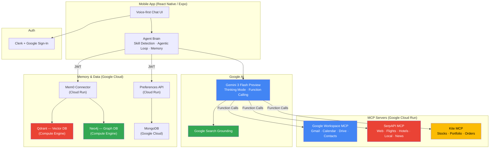
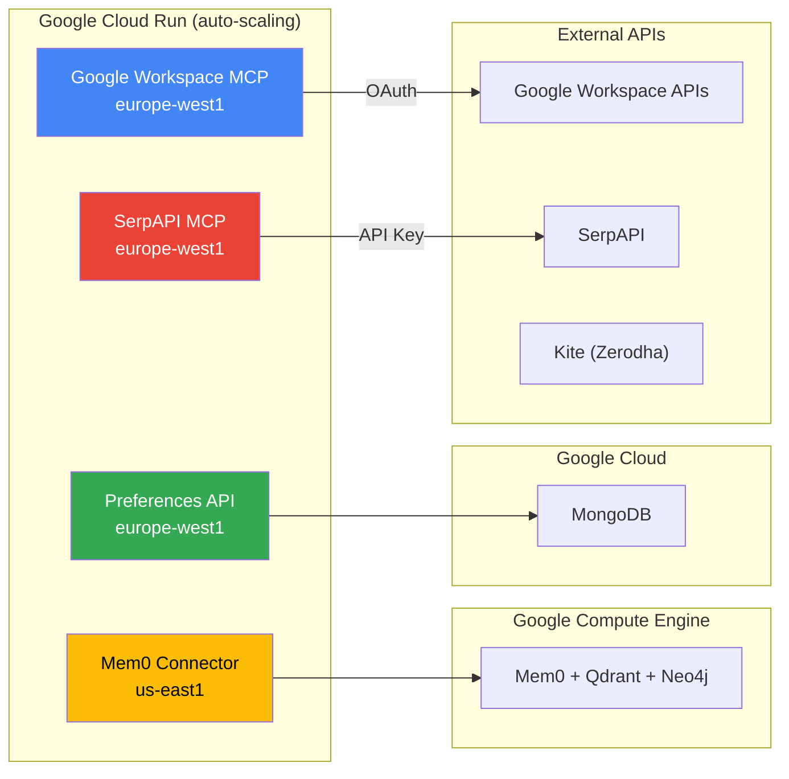

# 2nd Brain

> Your life, unified and connected.

A mobile AI assistant powered by **Google Gemini 3 Flash** that connects to your entire digital life through the **Model Context Protocol (MCP)**. One app, one conversation — email, calendar, flights, hotels, web search, memory, and more.

---

## Gemini 3 Integration

2nd Brain is built entirely around **Gemini 3 Flash Preview** as its reasoning core. Three features make the app possible:

**Thinking Mode** — Always enabled (4,000-token budget). Gemini reasons through multi-step problems before acting — decomposing "plan my Tokyo trip" into flight search, hotel search, calendar check, and event creation before executing any tool.

**Native Function Calling** — 21+ tools from Google Workspace and SerpAPI exposed as Gemini function declarations. The model picks the right tools, calls them with typed arguments, and chains up to 8 iterations per turn across multiple MCP servers — no hardcoded orchestration.

**Google Search Grounding** — Activates for real-time queries (weather, news, prices). Gemini grounds responses in live Google Search results with citations and source URLs.

Together these features turn Gemini 3 Flash from a text generator into an **autonomous agent** that thinks, acts, searches, and remembers.

---

## Architecture



---

## Deployment

All services run on **Google Cloud Platform**:



---

## Features

### Cognitive Architecture

2nd Brain isn't a stateless chatbot — it has a layered cognitive architecture:

- **Identity** (`types.ts`) — TypeScript interfaces defining the agent's shape: `AgentSoul`, `AgentSkill`, `AgentContext`
- **Soul** (`soul.ts`) — Persistent personality with 5 traits, 5 values, 11 skills, 7 quirks. Evolves with user preferences via `evolveSoul()`
- **Brain** (`brain.ts`) — Orchestration engine: skill detection, parallel memory retrieval, system prompt assembly, agentic loop (up to 8 Gemini calls per turn), post-processing
- **Memory** (`memory.ts`) — Long-term recall via Mem0 + Qdrant (vector) + Neo4j (graph). Four memory types: soul, conversation, preference, identity

### MCP Integrations

| MCP Server | Tools | Auth |
|---|---|---|
| **Google Workspace** | Gmail, Calendar, Drive, Contacts (13 tools) | OAuth 2.0 |
| **SerpAPI** | Web Search, Flights, Hotels, Local, News, Shopping, Social (8 tools) | API Key |
| **Kite (Zerodha)** | Portfolio, Orders, Market Data | API Key |
| **Google Search** | Real-time grounding with citations | Built-in (Gemini) |

### Google Workspace MCP — Deep Dive

The Google Workspace MCP is the primary integration, built with **FastMCP v3** and Python 3.11+. It acts as an **OAuth 2.0 proxy** giving the agent full access to Google services:

- **Gmail**: list, read, send, unread count
- **Google Drive**: list, search, create files
- **Google Calendar**: list events, get today's schedule, create events
- **Google Contacts**: list, search

**Security**:
- **PKCE** (Proof Key for Code Exchange) — prevents authorization code interception
- **Token Encryption** — Fernet (AES-128-CBC + HMAC-SHA256) for stored tokens
- **JWT Signing** — HS256 with secure key derivation
- **Consent Pages** — protection against confused deputy attacks

```
┌──────────────────┐     ┌──────────────────┐     ┌──────────────┐
│  2nd Brain App   │────▶│  FastMCP v3       │────▶│  Google APIs  │
│  (MCP Client)    │     │  OAuth Proxy      │     │  Gmail/Cal/   │
│                  │◀────│  PKCE + JWT + AES │◀────│  Drive/People │
└──────────────────┘     └──────────────────┘     └──────────────┘
```

Works with any MCP client (Claude Desktop, Cursor, etc.):

```json
{
  "mcpServers": {
    "google-workspace": {
      "url": "http://localhost:3000/mcp"
    }
  }
}
```

### SerpAPI MCP — Universal Search

A self-hosted MCP wrapping SerpAPI's full suite of Google search engines:

- `search` — Web search (compatible with [SerpApi MCP spec](https://serpapi.com/mcp))
- `search_flights` / `get_cheapest_flights` — Google Flights
- `search_hotels` / `get_hotel_details` / `find_budget_hotels` — Google Hotels
- `get_cache_stats` / `clear_cache` — Cache management

Also covers local results, social profiles, news, shopping, and images through the `search` tool. 5-minute in-memory cache reduces API costs by 50-70%.

### App

- Voice-first chat UI (tap to record, toggle to keyboard)
- MCP Marketplace — discover and connect servers
- Profile — preferences that shape the agent's soul
- Onboarding — two-step wizard (profile + goals)
- Clerk + Google Sign-In authentication
- Cross-platform: iOS, Android, Web

---

## Quick Start

### 1. App

```bash
npm install
cp .env.example .env
# Edit .env with your keys (see below)
npx expo start
```

### 2. Google Workspace MCP

```bash
cd google-mcp-python
uv sync
cp .env.example .env
# Set GOOGLE_CLIENT_ID, GOOGLE_CLIENT_SECRET
uv run server.py
# Runs at http://localhost:3000/mcp
```

See [`google-mcp-python/README.md`](./google-mcp-python/README.md) for OAuth setup.

### 3. SerpAPI MCP

```bash
cd travel-mcp-python
uv sync
cp .env.example .env
# Set SERPAPI_KEY (and optionally API_KEY for auth)
uv run server.py
# Runs at http://localhost:3001/mcp
```

See [`travel-mcp-python/README.md`](./travel-mcp-python/README.md) for tool details.

### Docker (MCP Servers)

```bash
# Google Workspace MCP
cd google-mcp-python && docker-compose up

# SerpAPI MCP
cd travel-mcp-python && docker-compose up
```

### Deploy to Google Cloud Run

Both MCP servers include Dockerfiles optimized for Cloud Run:

```bash
# SerpAPI MCP
cd travel-mcp-python
gcloud run deploy travel-mcp-server --source . --region europe-west1

# Google Workspace MCP
cd google-mcp-python
gcloud run deploy google-mcp --source . --region europe-west1
```

### Health Checks

```bash
curl http://localhost:3000/health   # Google Workspace MCP
curl http://localhost:3001/health   # SerpAPI MCP
```

### Environment Variables

```env
# Auth
EXPO_PUBLIC_CLERK_PUBLISHABLE_KEY=

# AI
EXPO_PUBLIC_GEMINIKEY=

# MCP Servers
EXPO_PUBLIC_MCP_SERVER_URL=         # Google Workspace MCP
EXPO_PUBLIC_MCP_TRAVEL_URL=         # SerpAPI MCP
EXPO_PUBLIC_MCP_KITE_URL=           # Kite MCP (optional)
EXPO_PUBLIC_MCP_API_KEY=            # API key for SerpAPI MCP (optional)

# Backend
EXPO_PUBLIC_MEMORY_API_URL=         # Mem0 connector
EXPO_PUBLIC_PREFERENCES_API_URL=    # Preferences API
```

---

## Tech Stack

| Layer | Technology | Provider |
|---|---|---|
| **AI Model** | Gemini 3 Flash Preview + 2.5 Flash (fallback) | Google |
| **Search Grounding** | Google Search | Google |
| **Mobile App** | React Native + Expo SDK 54 | Expo |
| **Auth** | Clerk + Google Sign-In | Clerk + Google |
| **MCP Protocol** | JSON-RPC 2.0 (Streamable HTTP) | Open Standard |
| **Google Workspace** | Gmail, Calendar, Drive, Contacts | Google |
| **Universal Search** | SerpAPI (Web, Flights, Hotels, Local, News, Shopping) | SerpAPI |
| **Memory** | Mem0 + Qdrant + Neo4j | Open Source |
| **Database** | MongoDB | Google Cloud |
| **Compute** | Google Cloud Run + Compute Engine | Google Cloud |
| **Containers** | Docker + uv | Open Source |
| **Languages** | TypeScript (app) + Python (MCPs) | — |

---

## Documentation

| Document | Description |
|---|---|
| [`WRITEUP.md`](./WRITEUP.md) | Full project writeup — architecture, challenges, accomplishments, future plans |
| [`ARCHITECTURE.md`](./ARCHITECTURE.md) | 11 Mermaid diagrams — system, orchestration, MCP, auth, memory, deployment |
| [`BLOG.md`](./BLOG.md) | Technical product launch blog with inline diagrams |
| [`GEMINI_INTEGRATION.md`](./GEMINI_INTEGRATION.md) | Gemini 3 feature usage (~200 words) |
| [`VIDEO_SCRIPT.md`](./VIDEO_SCRIPT.md) | 2:30 demo video script |
| [`google-mcp-python/README.md`](./google-mcp-python/README.md) | Google Workspace MCP setup |
| [`travel-mcp-python/README.md`](./travel-mcp-python/README.md) | SerpAPI MCP setup |

---

## Credits

Built at the **Gemini 3 Hackathon** with:
- [Google Gemini](https://ai.google.dev/) — AI model + Search grounding
- [Google Cloud Run](https://cloud.google.com/run) — MCP server hosting
- [Google Workspace APIs](https://developers.google.com/workspace) — Gmail, Calendar, Drive, Contacts
- [Model Context Protocol](https://modelcontextprotocol.io/) — Open standard for AI tool use
- [FastMCP](https://gofastmcp.com/) — Python MCP framework
- [SerpAPI](https://serpapi.com/) — Universal Google search API
- [Mem0](https://mem0.ai/) — Long-term memory framework
- [Clerk](https://clerk.com/) — Authentication
- [Expo](https://expo.dev/) — React Native framework

---

MIT License
